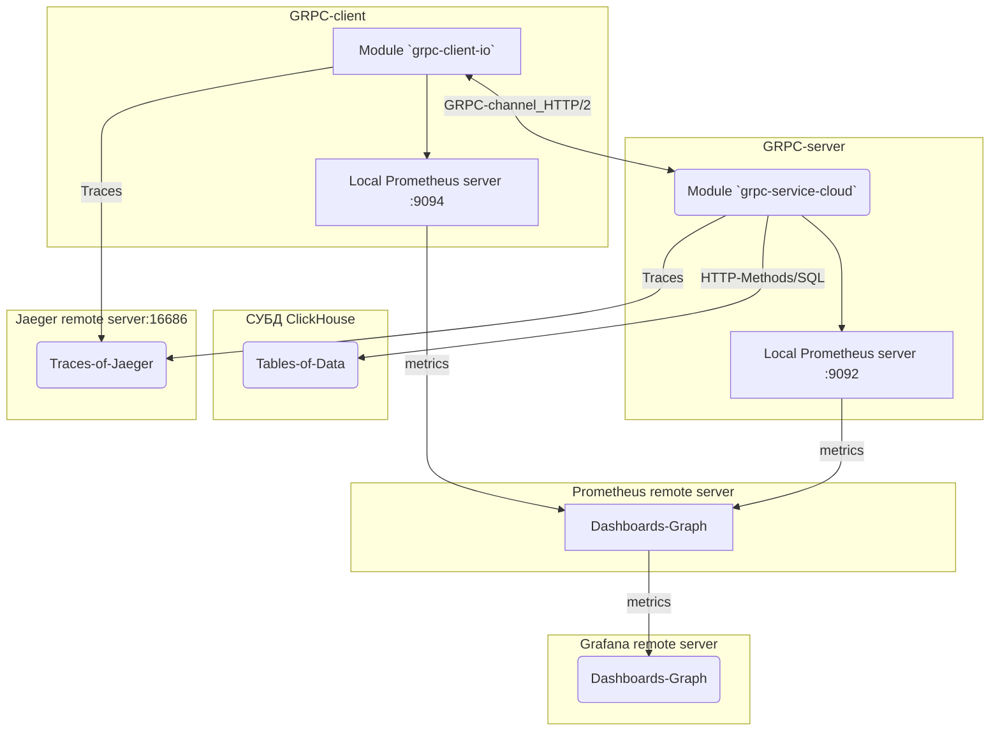

[](https://github.com/blablatov/scada-bidirectional-grpc-cloud/actions/workflows/scada-bidirectional-grpc-cloud.yml) 

## Содержание
- [Описание](https://github.com/blablatov/scada-bidirectional-grpc-cloud/blob/master/README.md#Описание-Description)
- [Сборка, тестирование сервиса](https://github.com/blablatov/scada-bidirectional-grpc-cloud/blob/master/README.md#Сборка-запуск-и-тестирование-gRPC-сервиса-Building-running-testing-gRPC-service)
- [Сборка, тестирование клиента](https://github.com/blablatov/scada-bidirectional-grpc-cloud/blob/master/README.md#Сборка-запуск-и-тестирование-gRPC-клиента-Building-running-testing-gRPC-client)
- [Генерация серверного и клиентского кода](https://github.com/blablatov/scada-bidirectional-grpc-cloud/blob/master/README.md#Генерация-серверного-и-клиентского-кода-с-IDL-Protocol-Buffers-Generate-via-IDL-of-Protocol-Buffers-Server-side-and-Client-side-code)
- [Отправка метрик в Prometheus, визуализация в Grafana](https://github.com/blablatov/scada-bidirectional-grpc-cloud/blob/master/README.md#Отправка-метрик-в-Prometheus-визуализация-в-Grafana-Sends-the-metrics-to-Prometheus-and-Grafana)  
- [Трассировка и визуализация в Jaeger](https://github.com/blablatov/scada-bidirectional-grpc-cloud/blob/master/README.md#Трассировка-методов-gRPC-сервиса-и-клиента-визуализация-данных-в-Jaeger-Tracking-with-Jaeger)  
- [Блок-схема обмена данными](https://github.com/blablatov/scada-bidirectional-grpc-cloud/blob/master/README.md#Блок-схема-обмена-данными-Block-diagram-of-work)


### Описание. Description   
Межсистемный двунаправленный gRPC-обмен зашифрованными и сжатыми данными. Запись данных в СУБД ClickHouse. Отправка метрик в Prometheus - Grafana. Трассировка и визуализация в Jaeger.  
Intersystem bidirectional gRPC exchange of encrypted and compressed data  
        

### Двунаправленный потоковый RPC. Bidirectional Streaming RPC 
В двунаправленном потоковом режиме запрос клиента и ответ сервера представлены в виде потоков сообщений.   
Вызов должен быть инициирован на клиентской стороне, клиент устанавливает соединение, отправляя заголовочные фреймы.   
Затем клиентское и серверное приложения обмениваются сообщениями с префиксом длины, не дожидаясь завершения взаимодействия с противоположной стороны. Клиент и сервер отправляют сообщения одновременно.
Используется модель ошибок, встроенная в протокол gRPC и более развитая модель ошибок, реализованная в пакете Google API google.rpc      

### Сборка, запуск и тестирование gRPC-сервиса. Building, running, testing gRPC-service  
[:arrow_up:Содержание](#Содержание)  

Перейти в `scada-bidirectional-grpc-cloud/grpc-service-cloud` и выполнить  
In order to build, Go to ``Go`` module directory location `scada-bidirectional-grpc-cloud/grpc-service-cloud` and execute the following
 shell command:
```
go build . && go run .  
```     

Тестирование бизнес-логики удаленных методов без передачи по сети. Имитация запуска сервера gRPC-сервера поверх HTTP/2 на реальном порту, с использованием буфера.  
Testing remote functions without using network. Using buffer. Bench-test  
```
go test .
```   
```
go test -bench=.
```   


### Сборка, запуск и тестирование gRPC-клиента. Building, running, testing gRPC-client  
[:arrow_up:Содержание](#Содержание)  

Перейти в `scada-bidirectional-grpc-cloud/grpc-client-io` и выполнить.    
In order to build, Go to ``Go`` module directory location `scada-bidirectional-grpc-cloud/grpc-client-io` and execute the following shell command:
```
go build . && go run .  
```  

Традиционный тест, который запускает клиент для проверки удаленного метода сервиса    
Перед его выполнением запустить grpc-сервер `./grpc-service-cloud`. Bench-test     
Conventional test that starts a gRPC client test the service with RPC. Before his execute run grpc-server:   
```
go test .  
```     
```
go test -bench=.
```    


### Генерация серверного и клиентского кода с IDL Protocol Buffers. Generate via IDL of Protocol Buffers Server side and Client side code  
[:arrow_up:Содержание](#Содержание)  

Перейти в `scada-bidirectional-grpc-cloud/grpc-cloud-proto` и выполнить.     
Go to ``Go`` module directory location `scada-bidirectional-grpc-cloud/grpc-cloud-proto` and execute the following shell commands:    
``` 
protoc grpc-cloud.proto --go_out=./ --go-grpc_out=./
protoc grpc-cloud.proto --go-grpc_out=require_unimplemented_servers=false:.
```   
Note: Future-proofing services (require_unimplemented_servers) -- false.   
This is not recommended, and the option is only provided to restore backward compatibility with previously-generated code.  


### Отправка метрик в Prometheus, визуализация в Grafana. Sends the metrics to Prometheus and Grafana  
[:arrow_up:Содержание](#Содержание)  

Включен мониторинг метрик для `gRPC`-сервера и `gRPC`-клиента. Перехватчики метрик добавлены в серверный и клиентский код. Встроенный `HTTP`-сервер для `Prometheus`, путь для сбора метрик сервера начинается с `/metrics` и доступен на порту `9092`, для сбора метрик клиента на порту `9094`  

  

В ОП Yandex Cloud на этой же ВМ поднят тестовый `Prometheus` доступен на порту `9090`. Конечная точка его подключения `targets: ['localhost:9092']`  

   


На другой ВМ `Grafana` доступна на порту `3000`  

  


### Трассировка методов gRPC-сервиса и клиента, визуализация данных в Jaeger. Tracking with Jaeger  
 [:arrow_up:Содержание](#Содержание)  
 
 На ВМ из тестового образа поднят `Jaeger` с локальным хранилищем данных. Single command line:  
 ```
 docker run --rm --name jaeger \
  -e COLLECTOR_ZIPKIN_HOST_PORT=:9411 \
  -p 6831:6831/udp \
  -p 6832:6832/udp \
  -p 5778:5778 \
  -p 16686:16686 \
  -p 4317:4317 \
  -p 4318:4318 \
  -p 14250:14250 \
  -p 14268:14268 \
  -p 14269:14269 \
  -p 9411:9411 \
  jaegertracing/all-in-one:1.55 
 ```  
 Строка подключения к серверу визуализации `Jaeger`. Link to `Jaeger` server:  
```
http://<cloud-host-ip>:16686
```  

  
 


### Блок-схема обмена данными. Block diagram of work     
[:arrow_up:Содержание](#Содержание)  
			


 

